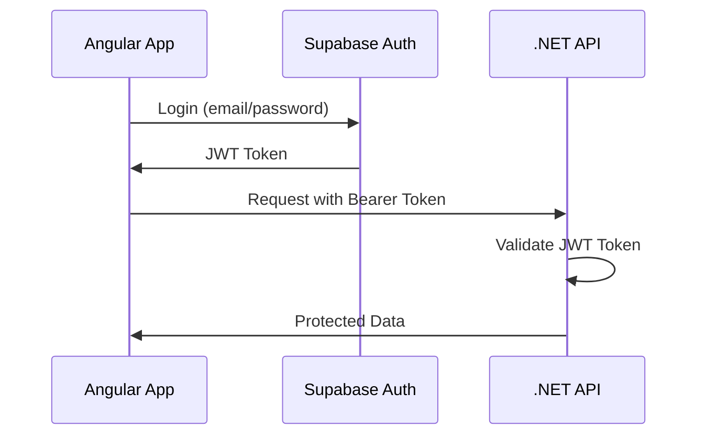

# Supabase Authentication Setup

## Overview

This project uses **Supabase Auth** for authentication. Users are managed by Supabase, and the .NET API validates JWT tokens issued by Supabase.

## 🔑 Configuration

### 1. Get Your Supabase Credentials

1. Go to your Supabase project dashboard: https://app.supabase.com
2. Navigate to **Settings** → **API**
3. Copy the following values:
   - **Project URL** (e.g., `https://cwvkrkiejntyexfxzxpx.supabase.co`)
   - **anon/public key** (starts with `eyJ...`)
   - **JWT Secret** (this is your service role key's secret, found under "JWT Settings")

### 2. Update appsettings.json

```json
{
  "Supabase": {
    "Url": "https://YOUR_PROJECT_REF.supabase.co",
    "AnonKey": "YOUR_ANON_KEY_HERE",
    "JwtSecret": "YOUR_JWT_SECRET_HERE"
  }
}
```

**Important**: The `JwtSecret` is the base64-encoded secret used to sign JWT tokens. You can find it in:
- Supabase Dashboard → Settings → API → JWT Settings → JWT Secret

### 3. Add to appsettings.Development.json (for development)

Create/update `appsettings.Development.json`:

```json
{
  "Supabase": {
    "Url": "https://cwvkrkiejntyexfxzxpx.supabase.co",
    "AnonKey": "your-anon-key-here",
    "JwtSecret": "your-jwt-secret-here"
  }
}
```

**Never commit actual secrets to source control!**

## 🚀 How It Works

### Authentication Flow



### 1. User Authenticates with Supabase (Angular Side)

```typescript
import { createClient } from '@supabase/supabase-js'

const supabase = createClient(
  'https://cwvkrkiejntyexfxzxpx.supabase.co',
  'YOUR_ANON_KEY'
)

// Sign up
const { data, error } = await supabase.auth.signUp({
  email: 'user@example.com',
  password: 'password123'
})

// Sign in
const { data, error } = await supabase.auth.signInWithPassword({
  email: 'user@example.com',
  password: 'password123'
})

// Get access token
const { data: { session } } = await supabase.auth.getSession()
const accessToken = session?.access_token
```

### 2. Send Token to API

```typescript
// Angular HTTP Interceptor
export class AuthInterceptor implements HttpInterceptor {
  intercept(req: HttpRequest<any>, next: HttpHandler) {
    const token = localStorage.getItem('supabase_token');
    
    if (token) {
      req = req.clone({
        setHeaders: {
          Authorization: `Bearer ${token}`
        }
      });
    }
    
    return next.handle(req);
  }
}
```

### 3. API Validates Token

The API automatically validates the JWT token using the middleware configured in `Program.cs`.

## 🔒 Using Authentication in Controllers

### Require Authentication

```csharp
[Authorize]
[ApiController]
[Route("api/[controller]")]
public class HouseholdsController : ControllerBase
{
    [HttpGet]
    public IActionResult GetHouseholds()
    {
        // Only authenticated users can access this
        var userId = User.FindFirst("sub")?.Value; // Supabase user ID
        var email = User.FindFirst("email")?.Value;
        
        // Your logic here
    }
}
```

### Get Current User

```csharp
[Authorize]
[HttpGet("me")]
public async Task<IActionResult> GetCurrentUser(
    [FromServices] ISupabaseAuthService authService)
{
    var authHeader = Request.Headers["Authorization"].FirstOrDefault();
    var token = authHeader?.Substring("Bearer ".Length).Trim();
    
    var user = await authService.GetUserFromToken(token);
    return Ok(user);
}
```

### Role-Based Authorization

```csharp
// Check user role from JWT claims
[Authorize]
[HttpPost("admin-only")]
public IActionResult AdminOnly()
{
    var role = User.FindFirst("role")?.Value;
    
    if (role != "admin")
    {
        return Forbid();
    }
    
    // Admin logic here
}
```

## 🧪 Testing Authentication

### 1. Using Swagger

1. Start your API: `dotnet run`
2. Open Swagger UI: `https://localhost:5001/swagger`
3. Click the **Authorize** button (padlock icon)
4. Enter: `Bearer YOUR_SUPABASE_JWT_TOKEN`
5. Try the protected endpoints

### 2. Using cURL

```bash
# Get a token from Supabase first (using your Angular app or Supabase dashboard)
TOKEN="eyJhbGciOiJIUzI1NiIsInR5cCI6IkpXVCJ9..."

# Test public endpoint
curl http://localhost:5000/api/authtest/public

# Test protected endpoint
curl -H "Authorization: Bearer $TOKEN" \
     http://localhost:5000/api/authtest/protected

# Get current user
curl -H "Authorization: Bearer $TOKEN" \
     http://localhost:5000/api/authtest/me
```

### 3. Using Postman

1. Create a new request
2. Set Authorization → Type: **Bearer Token**
3. Paste your Supabase JWT token
4. Send request to protected endpoint

## 📊 JWT Token Claims

Supabase JWT tokens contain these claims:

```json
{
  "sub": "user-uuid",              // User ID
  "email": "user@example.com",
  "phone": "+1234567890",
  "role": "authenticated",
  "aud": "authenticated",
  "iss": "https://your-project.supabase.co/auth/v1",
  "iat": 1234567890,
  "exp": 1234571490,
  "user_metadata": {
    "full_name": "John Doe",
    "avatar_url": "https://..."
  },
  "app_metadata": {
    "provider": "email",
    "providers": ["email"]
  }
}
```

Access these in your controller:

```csharp
var userId = User.FindFirst("sub")?.Value;
var email = User.FindFirst("email")?.Value;
var role = User.FindFirst("role")?.Value;
```

## 🔐 Best Practices

### 1. Store Tokens Securely (Angular)

```typescript
// ✅ Good - Use secure storage
import { Injectable } from '@angular/core';

@Injectable({ providedIn: 'root' })
export class AuthService {
  private readonly TOKEN_KEY = 'supabase_token';
  
  setToken(token: string) {
    // Use httpOnly cookies in production
    sessionStorage.setItem(this.TOKEN_KEY, token);
  }
  
  getToken(): string | null {
    return sessionStorage.getItem(this.TOKEN_KEY);
  }
  
  clearToken() {
    sessionStorage.removeItem(this.TOKEN_KEY);
  }
}

// ❌ Bad - Don't expose tokens
console.log('Token:', token); // Never log tokens!
```

### 2. Handle Token Expiration

```typescript
supabase.auth.onAuthStateChange((event, session) => {
  if (event === 'TOKEN_REFRESHED') {
    console.log('Token refreshed!');
    authService.setToken(session.access_token);
  }
  
  if (event === 'SIGNED_OUT') {
    authService.clearToken();
    router.navigate(['/login']);
  }
});
```

### 3. Validate User Exists in Your Database

```csharp
[Authorize]
[HttpGet("households")]
public async Task<IActionResult> GetHouseholds()
{
    var userId = Guid.Parse(User.FindFirst("sub")?.Value);
    
    // Check if user has household membership
    var households = await _context.HouseholdMembers
        .Where(hm => hm.UserId == userId && hm.IsActive)
        .Include(hm => hm.Household)
        .ToListAsync();
    
    if (!households.Any())
    {
        return NotFound("No households found for this user");
    }
    
    return Ok(households);
}
```

## 🔄 Migration: Supabase Auth Users → Your Database

When a user first authenticates, you may want to sync them to your database:

```csharp
[HttpPost("sync-user")]
[Authorize]
public async Task<IActionResult> SyncUser(
    [FromServices] ISupabaseAuthService authService)
{
    var token = Request.Headers["Authorization"]
        .FirstOrDefault()?
        .Substring("Bearer ".Length);
    
    var user = await authService.GetUserFromToken(token);
    
    // Check if user exists in AspNetUsers table
    var existingUser = await _context.Users
        .FirstOrDefaultAsync(u => u.Id == user.Id);
    
    if (existingUser == null)
    {
        // Create user record in your database
        var newUser = new AspNetUser
        {
            Id = user.Id,
            Email = user.Email,
            // ... other fields
        };
        
        _context.Users.Add(newUser);
        await _context.SaveChangesAsync();
    }
    
    return Ok();
}
```

## 📚 Additional Resources

- [Supabase Auth Documentation](https://supabase.com/docs/guides/auth)
- [Supabase JS Client](https://supabase.com/docs/reference/javascript/auth-signup)
- [JWT.io - Decode JWT Tokens](https://jwt.io/)

## 🐛 Troubleshooting

### "401 Unauthorized" Error

1. Check token is being sent: `Authorization: Bearer <token>`
2. Verify token hasn't expired (check `exp` claim)
3. Confirm JWT Secret in appsettings.json matches Supabase
4. Ensure Supabase URL is correct

### "Invalid Token" Error

1. Token must be from Supabase Auth (not a random JWT)
2. Check JWT Secret is base64-encoded correctly
3. Verify issuer (`iss`) matches your Supabase URL

### CORS Errors

The API is configured to allow Angular app on `http://localhost:4200`. Update `Program.cs` if your Angular app runs on a different port.

---

**Last Updated**: 2025-10-09

