# TheButler Database ERD - Mermaid Format

> **Last Updated:** 2025-01-09  
> **View:** This file can be rendered in GitHub, VS Code (with Mermaid extension), or any Mermaid viewer

```mermaid
erDiagram
    %% Core Tables
    households ||--o{ household_members : "has"
    households ||--o{ household_settings : "has"
    
    %% Financial - Accounts & Transactions
    households ||--o{ accounts : "has"
    accounts ||--o{ transactions : "has"
    transactions }o--|| categories : "belongs to"
    transactions }o--o| transactions : "parent"
    
    %% Financial - Budgets
    households ||--o{ budgets : "has"
    budgets ||--o{ budget_periods : "has"
    budgets }o--|| categories : "uses"
    households ||--o{ financial_goals : "has"
    financial_goals }o--o| priorities : "has"
    
    %% Financial - Subscriptions
    households ||--o{ subscriptions : "has"
    subscriptions }o--o| accounts : "uses"
    subscriptions }o--o| categories : "uses"
    subscriptions }o--|| frequencies : "bills"
    
    %% Bills & Payments
    households ||--o{ bills : "has"
    bills }o--o| accounts : "uses"
    bills }o--o| categories : "uses"
    bills }o--o| frequencies : "repeats"
    bills ||--o{ payment_history : "has"
    payment_history }o--o| transactions : "links to"
    
    %% Maintenance
    households ||--o{ maintenance_tasks : "has"
    maintenance_tasks }o--o| service_providers : "uses"
    maintenance_tasks }o--o| categories : "uses"
    maintenance_tasks }o--o| priorities : "has"
    maintenance_tasks }o--o| frequencies : "repeats"
    
    %% Inventory
    households ||--o{ inventory_items : "has"
    inventory_items }o--o| categories : "uses"
    inventory_items ||--o{ warranties : "has"
    inventory_items ||--o{ item_maintenance_schedules : "has"
    item_maintenance_schedules }o--|| frequencies : "uses"
    
    %% Documents
    households ||--o{ documents : "has"
    documents }o--o| categories : "uses"
    documents ||--o{ document_tags : "has"
    
    %% Insurance
    households ||--o{ insurance_policies : "has"
    insurance_policies }o--|| insurance_types : "is"
    insurance_policies }o--|| frequencies : "bills"
    insurance_policies ||--o{ insurance_beneficiaries : "has"
    
    %% Healthcare
    households ||--o{ healthcare_providers : "has"
    households ||--o{ appointments : "has"
    appointments }o--|| household_members : "for"
    appointments }o--o| healthcare_providers : "with"
    households ||--o{ medications : "has"
    medications }o--|| household_members : "for"
    medications }o--o| healthcare_providers : "prescribed by"
    medications ||--o{ medication_schedules : "has"
    households ||--o{ medical_records : "has"
    medical_records }o--|| household_members : "for"
    medical_records }o--o| healthcare_providers : "from"
    households ||--o{ health_metrics : "has"
    health_metrics }o--|| household_members : "for"
    households ||--o{ allergies : "has"
    allergies }o--|| household_members : "for"
    households ||--o{ vaccinations : "has"
    vaccinations }o--|| household_members : "for"
    vaccinations }o--o| healthcare_providers : "administered by"
    
    %% System Tables
    households ||--o{ alerts : "has"
    households ||--o{ reminders : "has"
    households ||--o{ activity_logs : "has"
    
    %% Lookup Tables (shared)
    categories ||--o{ transactions : "categorizes"
    categories ||--o{ bills : "categorizes"
    categories ||--o{ budgets : "categorizes"
    categories ||--o{ subscriptions : "categorizes"
    categories ||--o{ maintenance_tasks : "categorizes"
    categories ||--o{ documents : "categorizes"
    categories ||--o{ inventory_items : "categorizes"
    categories ||--o{ service_providers : "categorizes"
    
    frequencies ||--o{ bills : "defines"
    frequencies ||--o{ subscriptions : "defines"
    frequencies ||--o{ maintenance_tasks : "defines"
    frequencies ||--o{ item_maintenance_schedules : "defines"
    frequencies ||--o{ insurance_policies : "defines"
    
    priorities ||--o{ maintenance_tasks : "ranks"
    priorities ||--o{ financial_goals : "ranks"
```

## Table Definitions

### Core Tables
- **households**: Main organizational unit
- **household_members**: Links users to households
- **household_settings**: Key-value settings per household

### Financial Tables
- **accounts**: Bank/financial accounts
- **transactions**: Income/expense transactions
- **budgets**: Budget definitions
- **budget_periods**: Period-specific budget tracking
- **financial_goals**: Savings goals
- **subscriptions**: Recurring subscriptions

### Bills & Payments
- **bills**: Bill tracking
- **payment_history**: Payment records

### Maintenance
- **service_providers**: Service companies/contractors
- **maintenance_tasks**: Home maintenance tasks

### Inventory
- **inventory_items**: Household items
- **warranties**: Item warranties
- **item_maintenance_schedules**: Maintenance schedules for items

### Documents
- **documents**: Document storage
- **document_tags**: Document tagging

### Insurance
- **insurance_policies**: Insurance policies
- **insurance_beneficiaries**: Policy beneficiaries
- **insurance_types**: Insurance type lookup

### Healthcare
- **healthcare_providers**: Doctors, clinics, etc.
- **appointments**: Medical appointments
- **medications**: Medications
- **medication_schedules**: Medication schedules
- **medical_records**: Medical records
- **health_metrics**: Health measurements
- **allergies**: Allergies
- **vaccinations**: Vaccination records

### System Tables
- **notifications**: User notifications
- **alerts**: Household alerts
- **reminders**: Reminders
- **activity_logs**: Audit logs

### Lookup Tables
- **categories**: Shared category lookup
- **frequencies**: Frequency lookup (weekly, monthly, etc.)
- **priorities**: Priority lookup (low, medium, high, urgent)

